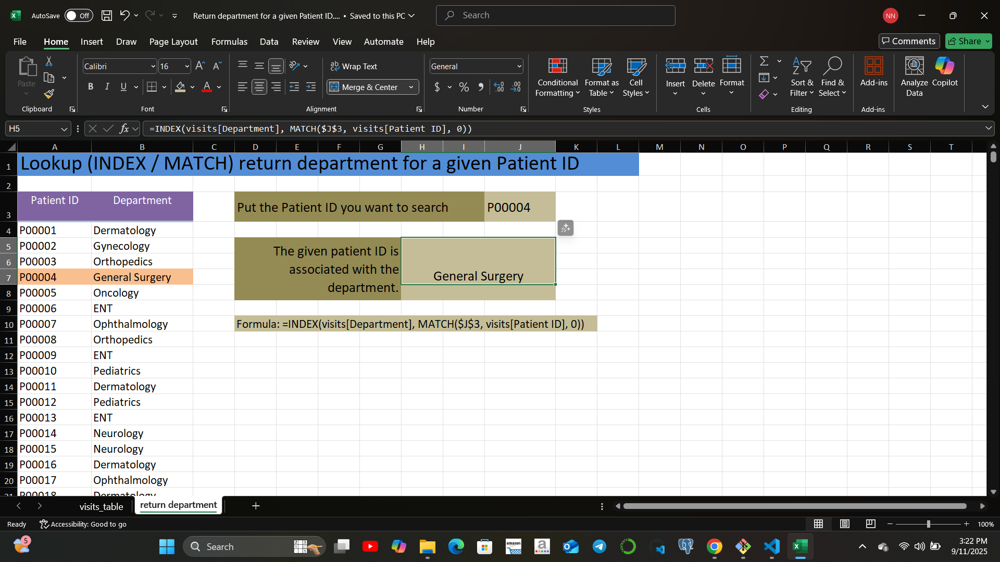
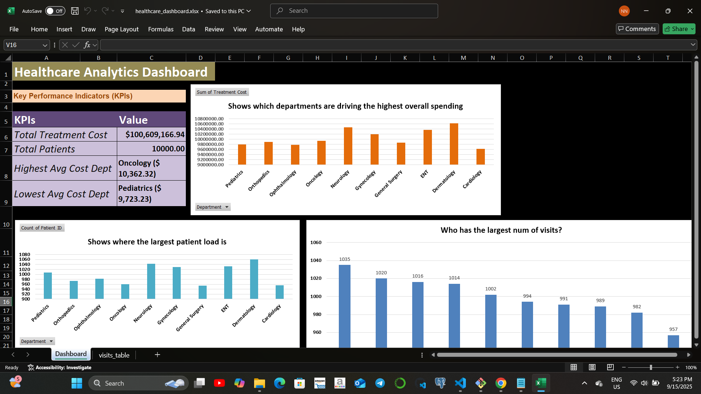

# Healthcare Analytics

This repository contains a **fictional healthcare dataset with 10,000 rows**.  
The dataset was created for practicing **Excel data analytics** and to showcase knowledge in:

- Excel formulas & functions (`SUMIFS`, `IF`, `VLOOKUP`, etc.)
- Pivot tables & pivot charts
- Conditional formatting
- Data cleaning & transformation
- Lookup operations
- Dashboard creation for insights

The project is part of my preparation for the **Google Data Analytics Apprenticeship (March 2026)**.  
It demonstrates both **technical Excel skills** and the ability to structure a professional analytics project.

## Project Goal

This repository is not just a dataset — it is a portfolio project designed to:
1. Demonstrate advanced Excel skills.
2. Practice storytelling through dashboards.

## Repo Structure
- healthcare-analytics-excel/
  - analysis/
  - dashboard/
    - healthcare_dashboard.xlsx
  - data/
    - healthcare_dataset_raw.xlsx
    - healthcare_dataset_cleaned.xlsx
  - docs/
    - screenshots/
  - README.md

## Dataset Information

**File:** `data/healthcare_dataset.xlsx`  
**Rows:** ~10,000  
**Type:** Fully fictional (no real patient data used)  

### Key Columns
- `Patient_ID`      - `Gender`             - `Age`
- `Date of Visit`   - `Department`         - `Physician Name`   
- `Diagnosis`       - `Treatment Type`     - `Treatment Cost` 
- `Payment Method`  - `Follow-up Required` - `Patient Satisfaction Rating`

This structure allows for practicing **time-based analysis, financial analysis, and patient trends**.

## Analysis

These are analytics-style questions to solve in Excel.  
Each question has a placeholder **analysis/docs area** (where I will add formulas, and pivot table steps).  

### Top 10 Patients by Treatment Cost (Highest Spenders)

Here is a preview of the Excel analysis:

### Average Treatment Costs by Treatment Type

Here is a preview of the Excel analysis:

### Revenue breakdown by payment method

Here is a preview of the Excel analysis:

### Age group analysis

Here is a preview of the Excel analysis: 

### Find the insurance provider of a patient when their Patient ID is entered 

Here is a preview of the Excel analysis: 

### Physician with the highest patient load 
  
Here is a preview of the Excel analysis:   

### Follow-up required rate by department

Here is a preview of the Excel analysis:   

### Lookup: return department for a given Patient ID

Here is a preview of the Excel analysis:   

## Dashboard Preview  

- Below is a preview of the Excel dashboard:  

- Check the file in the  
[`dashboard/`](dashboard/) folder:  

- `healthcare_dashboard.xlsx`

## Key Insights  

1. **Oncology and Neurology drive the highest treatment costs**, mainly due to expensive procedures like Radiation Therapy and Chemotherapy — making them prime areas for cost optimization.  

2. **Payment methods show that Insurance and Government Aid cover most treatments**, while Self-pay remains limited — highlighting reliance on institutional funding over out-of-pocket care.  

3. **A small group of high-cost patients contributes disproportionately to total revenue**, underlining the importance of targeted care management for resource allocation.  

