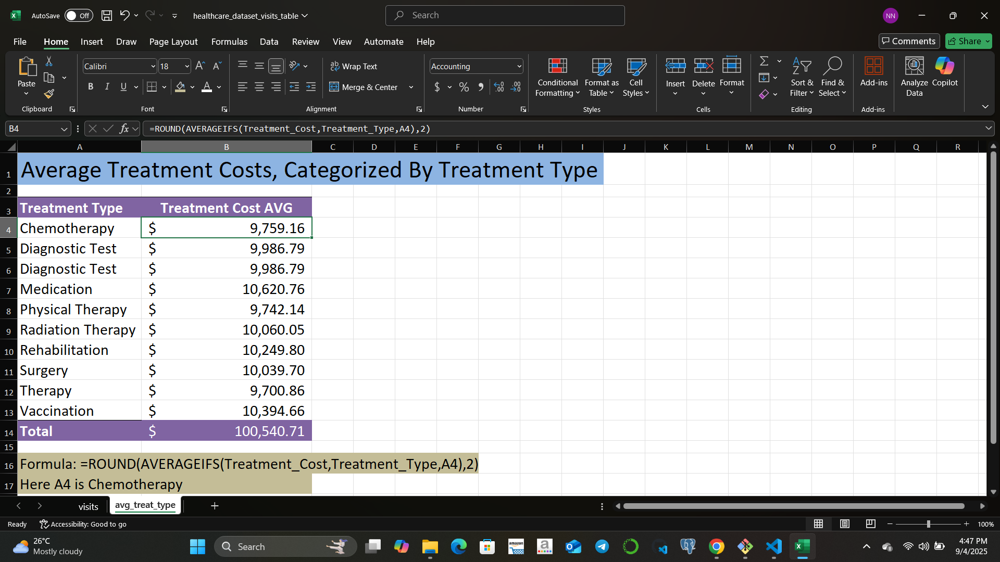

# 📊 Healthcare Analytics (Excel Project)

This repository contains a **fictional healthcare dataset with 10,000 rows**.  
The dataset was created for practicing **Excel data analytics** and to showcase knowledge in:

- Excel formulas & functions (`SUMIFS`, `IF`, `XLOOKUP`, `TEXT`, `DATE`, etc.)
- Pivot tables & pivot charts
- Conditional formatting
- Data cleaning & transformation
- Lookup operations
- Dashboard creation for insights

The project is part of my preparation for the **Google Data Analytics Apprenticeship (March 2026)**.  
It demonstrates both **technical Excel skills** and the ability to structure a professional analytics project.

---

## 📂 Dataset Information

**File:** `data/healthcare_dataset.xlsx`  
**Rows:** ~10,000  
**Type:** Fully fictional (no real patient data used)  

### Key Columns
- `Patient_ID`
- `Age`
- `Gender`
- `Admission_Date`
- `Discharge_Date`
- `Department`
- `Doctor`
- `Diagnosis`
- `Treatment`
- `Length_of_Stay`
- `Bill_Amount`
- `Payment_Method`
- `Insurance_Provider`

This structure allows for practicing **time-based analysis, financial analysis, and patient trends**.

---

## ❓ Analysis

These are analytics-style questions to solve in Excel.  
Each question has a placeholder **analysis/docs area** (where I will add formulas, and pivot table steps).  

### 1.Top 10 Patients by Treatment Cost (Highest Spenders)

Here is a preview of the Excel analysis:


### 2.Average Treatment Costs by Treatment Type

Here is a preview of the Excel analysis:


### 3.Revenue breakdown by payment method

Here is a preview of the Excel analysis:


### 4.Age group analysis

Here is a preview of the Excel analysis: 


### 5.Find the insurance provider of a patient when their Patient ID is entered 

Here is a preview of the Excel analysis: 


### 6.Physician with the highest patient load 
  
Here is a preview of the Excel analysis:   


### 7.Follow-up required rate by department

Here is a preview of the Excel analysis:   


8. **Which insurance provider covers the highest total billing?**  
   _Solution: (Pivot table by Insurance Provider)_

9. **Use a lookup formula to return the department of a given patient ID.**  
   _Solution: (`XLOOKUP` or `VLOOKUP`)_

10. **Highlight bills above the department average using conditional formatting.**  
    _Solution: (Conditional formatting with formula rule)_

---

## 📊 Dashboard Ideas

I plan to build an **Excel dashboard** using slicers, pivot charts, and KPIs.  

Key features:
- **Admissions Overview**: Monthly admissions trend, top 5 diagnoses.  
- **Financial Analysis**: Department-wise revenue, top doctors by billing.  
- **Patient Demographics**: Gender split, age group distribution.  
- **Insurance Insights**: Insurance vs. self-pay analysis, top insurance providers.  
- **Length of Stay Analysis**: Average stay by department/diagnosis.  

Example layout:
- **Top row** → KPIs (Total Patients, Avg Bill, Avg Stay)  
- **Left side** → Slicers (Year, Department, Payment Method)  
- **Center** → Pivot charts (admissions trend, billing distribution)  
- **Right side** → Tables (top doctors, insurance breakdown)  

---

## 📸 Adding Images

I will add:
- **Screenshots of pivot tables & formulas** in the `images/` folder  
- **Final dashboard screenshot** to showcase my work  

Example:
```markdown


## 🚀 Project Goal

This repository is not just a dataset — it is a portfolio project designed to:
1. Demonstrate advanced Excel skills.
2. Practice storytelling through dashboards.
